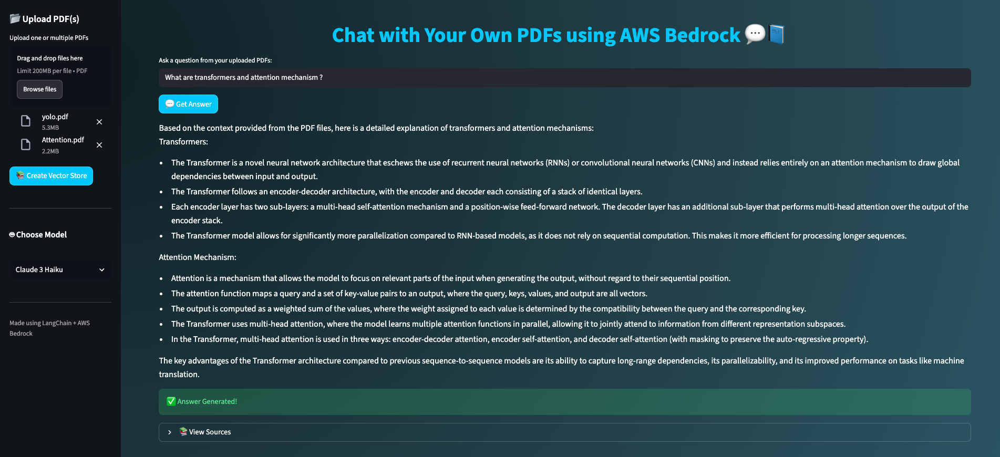
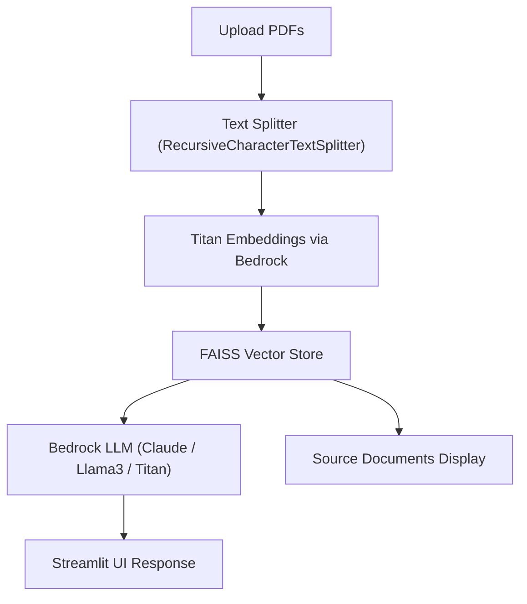

# 💬 Chat with Your Own PDFs using AWS Bedrock

> “Turn static PDFs into interactive conversations — powered by AWS Bedrock, LangChain, and Streamlit.”

---

## App Interface Snapshot


## 🚀 Overview
**Chat with Your Own PDFs using AWS Bedrock** is a **Retrieval-Augmented Generation (RAG)** application that allows users to **upload any PDF**, automatically generate embeddings using **Amazon Titan**, and query the content conversationally using **Claude 3 Haiku**, **Llama3 70B**, or **Titan Text G1** — all served via **AWS Bedrock**.

This project bridges cloud AI models with document intelligence and a clean, modern Streamlit interface — enabling real-time, explainable responses grounded in your data.

---

## 🧠 Core Features

| Category | Description |
|-----------|--------------|
| **📂 Real-time PDF Uploads** | Upload multiple PDFs directly through the UI and instantly build a FAISS vector store. |
| **🧮 Titan Text Embeddings** | Each document chunk is vectorized using `amazon.titan-embed-text-v1` for high-precision retrieval. |
| **🤖 Multi-Model Orchestration** | Choose between **Claude 3 Haiku**, **Llama3 70B**, or **Titan Text G1** at runtime. |
| **🔍 RAG Pipeline** | Combines contextual retrieval + prompt generation for accurate answers. |
| **🎨 Interactive UI** | Streamlit-powered with gradient backgrounds, dynamic progress spinners, and typing animations. |
| **📚 Source Transparency** | Displays the original page number, file name, and excerpt for every generated response. |
| **🧱 Modular Design** | Fully modular functions for ingestion, embeddings, retrieval, and model execution. |

---

## 🏗️ Tech Stack

| Layer | Technology |
|--------|-------------|
| **Frontend/UI** | Streamlit |
| **Backend** | Python 3.10 + Boto3 |
| **Cloud AI Models** | AWS Bedrock (Claude 3 Haiku, Llama3 70B, Titan Text G1, Titan Embeddings) |
| **Vector Store** | FAISS |
| **Frameworks** | LangChain, LangChain-Community |
| **Environment** | MacBook M3 + Visual Studio Code |

---

## 🧩 Architecture



---

## ⚙️ Installation & Setup

- Clone the repository
```
git clone https://github.com/pahul1712/Chat-with-PDF-using-AWS-Bedrock.git
cd Chat-with-PDF-using-AWS-Bedrock
```

- Create and activate a virtual environment
```
python3 -m venv venv
source venv/bin/activate   # On Mac/Linux
venv\Scripts\activate      # On Windows
```

- Install dependencies
```
pip install -r requirements.txt
```

- Run the app
```
streamlit run app.py
```

---


## 🧾 Folder Structure
```bash
Chat-with-PDF-using-AWS-Bedrock/
│
├── app.py                 # Main Streamlit Application
├── requirements.txt       # Required dependencies
├── data/                  # (Optional) Preloaded PDFs
├── faiss_index/           # Auto-generated FAISS vector store
├── output/                # Generated files (if any)
├── venv/                  # Virtual environment
└── claude.py / llama3.py  # Practice scripts for Bedrock models
```

---

## ✨ How It Works

- Upload PDFs → Extract text and split into chunks.
- Embed with Titan → Each chunk is converted into numerical vectors.
- Store with FAISS → Enables fast similarity search for queries.
- Ask Questions → Retrieve the most relevant context and generate an answer using a chosen model.
- View Sources → Transparency for every answer with file name, page, and excerpt.

---

## 🧑‍💻 Author

Pahuldeep Singh Dhingra  
🎓 M.S. in Data Science & Analytics @ Florida Atlantic University  
💼 Graduate Teaching Assistant (ANN, OOP, Foundations of Computing)


